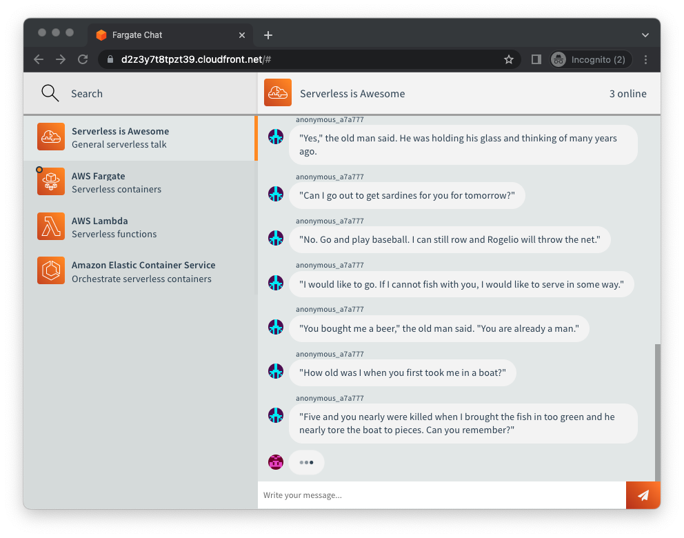

# Fargate.chat

[](https://fargate.chat)

A Slack-like chat app built with [Node.js](https://nodejs.org/en/) and [Vue.js](https://vuejs.org/) and deployed using Amazon Web Services.

This application uses Docker containers in [AWS Fargate](https://aws.amazon.com/fargate/), and [AWS App Runner](https://aws.amazon.com/apprunner/), as well as [AWS Lambda](https://aws.amazon.com/lambda/) functions.

A sample version of the app is hosted at: https://fargate.chat

### Architecture features

- No EC2 instances. One of the goals of this application architecture is that it is very hands off, nothing to manage or update. Serverless features are turned on wherever possible.
- Fully defined as infrastructure as code, using [AWS CloudFormation](https://aws.amazon.com/cloudformation/) to create all the application resources.
- Included `docker-compose.yml` which stands up a local copy of DynamoDB, and local copy of the socket.io chat server. This allows you to develop locally and see the application at `http://localhost:3000`. The only feature that does not run locally, and is just simulated is the full text chat search.
- Integration test suite container that you can run against a copy of the application, either locally or remotely.

Read more about [the architecture and services in use](/docs).

### Application features

- User account functionality, including anonymous accounts
- Real time chat message sending over WebSocket protocol, with persistance in DynamoDB
- Live user presence, including announcments when users join or leave
- Unread message indicator
- Typing indicator, including support for multiple typers at once.
- Full text search for chat messages, powered by Amazon OpenSearch Serverless
- Infinite virtual DOM scrolling, for performant feeling even when many thousands of messages have been sent in a room.

### Setup instructions

Install if not already installed:

* Docker: https://docs.docker.com/get-docker/
* AWS SAM CLI: https://docs.aws.amazon.com/serverless-application-model/latest/developerguide/install-sam-cli.html
* Install Node and NPM if not present

```
# Setup some env variables for later
# Can try other regions as long as all required services are in that region
export AWS_REGION=us-east-2
export AWS_ACCOUNT=$(aws sts get-caller-identity --query Account --output text)

# Install the dependencies off of NPM
(cd services/message-indexer; npm install)
(cd services/message-search; npm install)

# Setup the base VPC and networking stuff.
sam deploy \
  --region $AWS_REGION \
  --template-file infrastructure/cluster.yml \
  --stack-name chat-cluster \
  --capabilities CAPABILITY_IAM

# The shared resources like DynamoDB table and OpenSearch Serverless
sam deploy \
  --region $AWS_REGION \
  --template-file infrastructure/resources.yml \
  --stack-name chat-resources \
  --capabilities CAPABILITY_IAM

# Create an ECR repository to host the container image
aws ecr create-repository \
  --region $AWS_REGION \
  --repository-name fargate-chat

# Login to the ECR repository
aws ecr get-login-password --region $AWS_REGION | docker login --username AWS --password-stdin $AWS_ACCOUNT.dkr.ecr.$AWS_REGION.amazonaws.com

# Build the Docker image
docker build -t fargate-chat ./services/socket

# Upload the built container image to the repository
docker tag fargate-chat:latest $AWS_ACCOUNT.dkr.ecr.$AWS_REGION.amazonaws.com/fargate-chat:latest
docker push $AWS_ACCOUNT.dkr.ecr.$AWS_REGION.amazonaws.com/fargate-chat:latest

# Start up the container that runs in AWS Fargate
sam deploy \
  --region $AWS_REGION \
  --template-file infrastructure/chat-service.yml \
  --stack-name chat-service \
  --capabilities CAPABILITY_IAM \
  --parameter-overrides ImageUrl=$AWS_ACCOUNT.dkr.ecr.$AWS_REGION.amazonaws.com/fargate-chat:latest

# IN PROGRESS - Deploy the component which indexes sent chat messages
sam deploy \
  --region $AWS_REGION \
  --template-file infrastructure/message-indexer.yml \
  --stack-name chat-message-indexer \
  --resolve-s3 \
  --capabilities CAPABILITY_IAM

# Deploy the component which provides search autocomplete and API Gateway
sam deploy \
  --region $AWS_REGION \
  --template-file infrastructure/message-search.yml \
  --stack-name chat-message-search \
  --resolve-s3 \
  --capabilities CAPABILITY_IAM

# Build the component which hosts static web content
aws ecr create-repository \
  --region $AWS_REGION \
  --repository-name apprunner-web

# Build the Docker image
docker build -t apprunner-web ./services/web

# Upload the built container image to the repository
docker tag apprunner-web:latest $AWS_ACCOUNT.dkr.ecr.$AWS_REGION.amazonaws.com/apprunner-web:latest
docker push $AWS_ACCOUNT.dkr.ecr.$AWS_REGION.amazonaws.com/apprunner-web:latest

# Launch the web container inside of App Runner
sam deploy \
  --region $AWS_REGION \
  --template-file infrastructure/web.yml \
  --stack-name chat-web \
  --resolve-s3 \
  --parameter-overrides ImageUrl=$AWS_ACCOUNT.dkr.ecr.$AWS_REGION.amazonaws.com/apprunner-web:latest \
  --capabilities CAPABILITY_IAM

# Deploy CloudFront distribution which ties main app and search endpoint together on one domain
sam deploy \
  --region $AWS_REGION \
  --template-file infrastructure/cloudfront.yml \
  --stack-name chat-cloudfront \
  --resolve-s3 \
  --capabilities CAPABILITY_IAM

# Get the application URL to view it
aws cloudformation describe-stacks \
  --stack-name chat-cloudfront \
  --query "Stacks[0].Outputs[?OutputKey==\`PublicURL\`].OutputValue" \
  --output text

# Open the URL in the browser window

```

## Project layout

```
/deps - Folder used only for local development purposes
/infrastructure - CloudFormation templates used for deployment to AWS
/services - Independent code components that make up the app
  /socket - The core Node.js socket.io app, which runs in AWS Fargate
  /message-indexer - Lambda function which triggers on DynamoDB updates, to index chat messages
  /message-search - Lamdba function triggered by API Gateway, answers search queries
  /test-suite - Container used for local tests, runs integ tests against socket service
  /message-index-drop - Admin Lambda function which drops the OpenSearch Serverless collection
  /web - Frontend service which serves the static web files in production
```

## Admin and dev actions

If you want to drop the search index (will be recreated next time you send a message, though older messages will no longer be remembered)

```
sam deploy \
  --region $AWS_REGION \
  --template-file infrastructure/message-index-drop.yml \
  --stack-name chat-index-drop \
  --resolve-s3 \
  --capabilities CAPABILITY_IAM
```

Run a local copy of the socket app for testing:

```
make run    # Standup local DynamoDB and local stack
make test   # Rebuild and run tests locally

# Open localhost:3000 in browser to view app
```

Launch the public facing CloudFormation stack with a custom domain name and SSL cert:

```
sam deploy \
  --region $AWS_REGION \
  --template-file infrastructure/cloudfront.yml \
  --stack-name chat-cloudfront \
  --resolve-s3 \
  --capabilities CAPABILITY_IAM \
  --parameter-overrides DomainName=fargate.chat CertArn=arn:aws:acm:us-east-1:228578805541:certificate/45b4037a-2257-48ff-b3ae-b8e3e0523e85
```