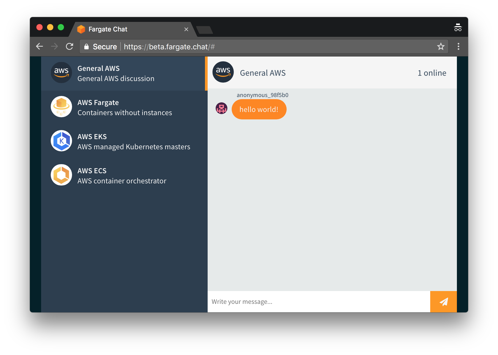

# Fargate.chat

[](https://fargate.chat)

A simple Slack-like chat app built with [Node.js](https://nodejs.org/en/) and [Vue.js](https://vuejs.org/) and deployed using Amazon Web Services, running in Docker containers in [AWS Fargate](https://aws.amazon.com/fargate/).

Features:

- No EC2 instances. One of the goals of this application architecture is that it is very hands off, nothing to manage or update.
- Fully defined as infrastructure as code, using [AWS CloudFormation](https://aws.amazon.com/cloudformation/) to create all the application resources.
- CI/CD Pipeline using [AWS CodePipeline](https://aws.amazon.com/codepipeline/), so that you can just push to the Github and it will automatically deploy.
- Automated Docker container builds using [AWS CodeBuild](https://aws.amazon.com/codebuild/)

You can view a running copy of this app, deployed on AWS at: [fargate.chat](https://fargate.chat)

## Deploy it yourself

This repository includes [instructions for how to deploy this application yourself](./docs/deploy.md), including buying your own Route 53 domain name, creating an SSL certificate, setting up the CI/CD pipeline.

## Run it locally

To run the application on your local machine you need:

- `docker`
- `docker-compose`
- `make`

Execute the following command:

```
make run
```

The application will be available at `http://localhost:3000`

If you make changes to the code, you can run:

```
make build
```

This updates the client application.

To run integration tests execute:

```
make test
```
