# How to deploy this application on AWS

The guide walks you through the process of deploying a production grade copy of this software on your own AWS account. The deployed application will have:

- High availability and autoscaling
- A custom Route 53 powered domain name and an SSL certificate for HTTPS
- A CI/CD pipeline so that you can deploy or redeploy changes to the application with a simple `git commit` + `git push`

## 1. Create a domain name to host the application

Go to [Route 53](https://console.aws.amazon.com/route53/home) and you'll see a box to "Register a domain". Go ahead and purchase a domain name of your choice.

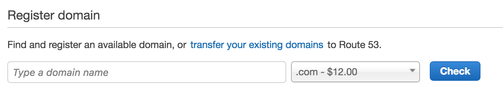

Once your domain is purchased and processed you'll see it show up on [your list of domains](https://console.aws.amazon.com/route53/home?#DomainListing:):

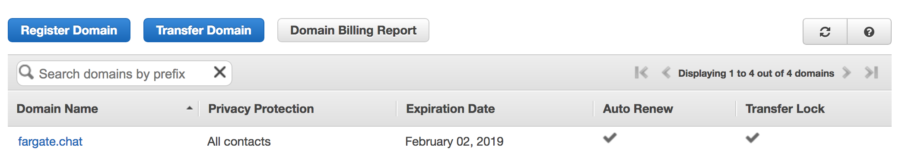

## 2. Register an SSL certificate for the domain

Now go to [Amazon Certificate Manager](https://console.aws.amazon.com/acm/home) to get a free SSL certificate for the domain. Click the "Request a certificate" button.

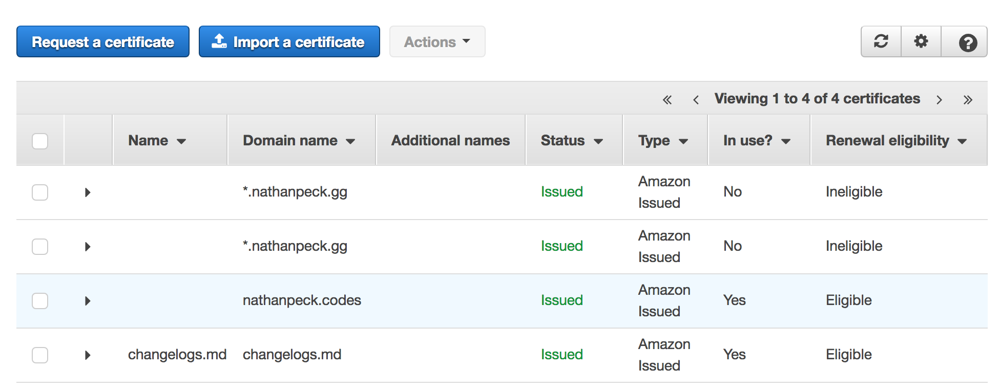

Then we need to select that we want a "public certificate" because this is a certificate public web browsers will use for communicating securely with the chat app.

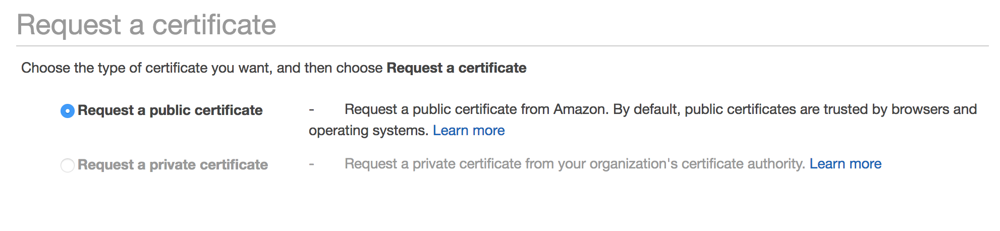

Then add the list of domains that should be covered by the SSL certificate. For maximum flexibility I prefer to have both the bare domain and a wildcard domain in the same certificate:

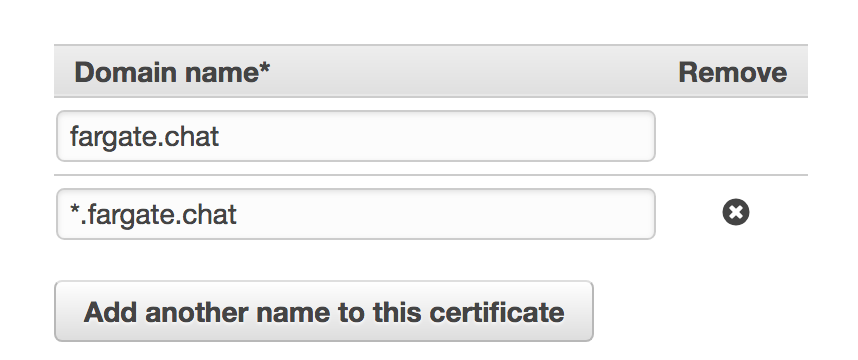

This allows me to serve HTTPS traffic on https://fargate.chat as well as on any subdomains if for example I want to have https://beta.fargate.chat

ACM can take care of automatically validating the certificate for you if you are also hosting the domain on Route 53. After a few mins I am able to view the details of the created certificate and get the certificate ARN (Amazon Resource Name):

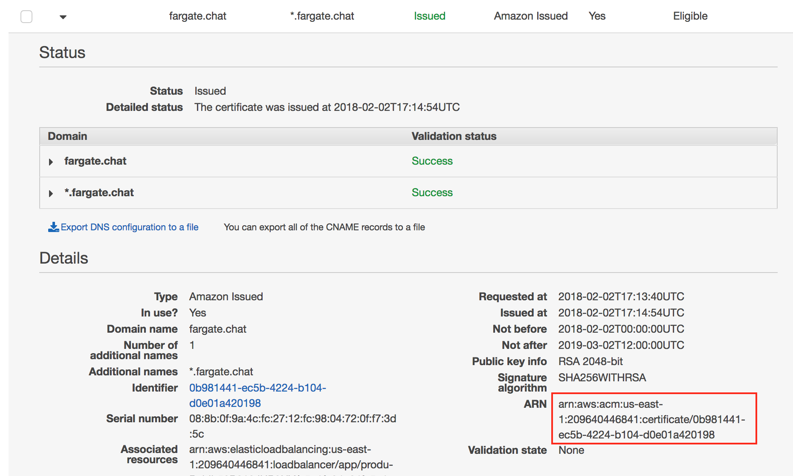

Copy that ARN value for usage later.

## 3. Setup a copy of the Github repo for CI/CD

First clone this repo onto your Github account by clicking the "Fork" button in the upper right:

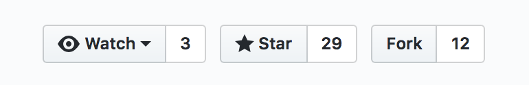

Then go to your [Github settings to generate a new token](https://github.com/settings/tokens). Click on "Generate new token" and create a token which has the following access:

- admin:repo_hook
- repo

These two permissions will allow AWS CodePipeline to monitor the Github repo for changes, and react to updates by redeploying the application.

## 4. Deploy the CodePipeline on your account

Download the repository using `git clone` and once the source is on your machine look for the file `pipeline.yml` in the top directory of the repo. This is a CloudFormation template which creates a CI/CD pipeline.

Go to [AWS CloudFormation](https://console.aws.amazon.com/cloudformation/home) and click the "Create Stack" button. In the following dialog click "Choose File" and select the `pipeline.yml` file you located, then click "Next". You will see a list of input parameters. Fill them in with the appropriate values:

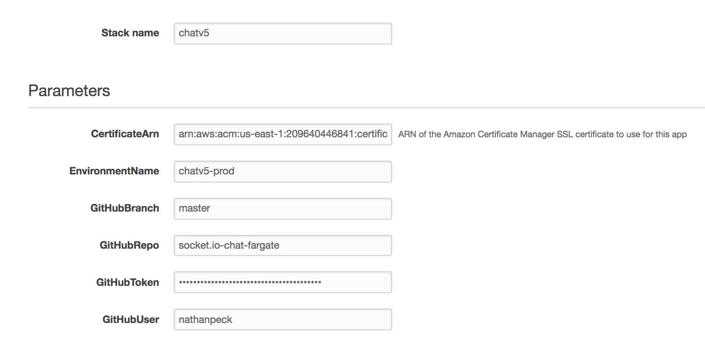

Click Next twice, select the checkbox next to "I acknowledge that AWS CloudFormation might create IAM resources." and then click "Create". You will see a CloudFormation template in the `CREATE_IN_PROGRESS` state.

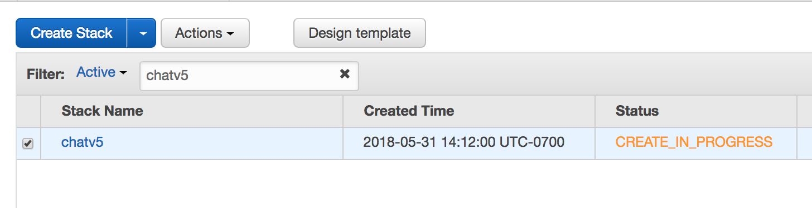

This template is creating an AWS CodePipeline for you. You can view the [source of the template](../pipeline.yml) in the meantime to understand what is being setup.

After about a minute you will see another CloudFormation template appear:

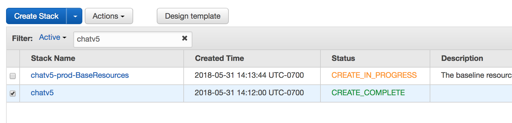

This template was automatically deployed by the pipeline itself. To understand how this happened visit [AWS CodePipeline](https://console.aws.amazon.com/codepipeline/home) in your AWS console and click to view the details of the pipeline:

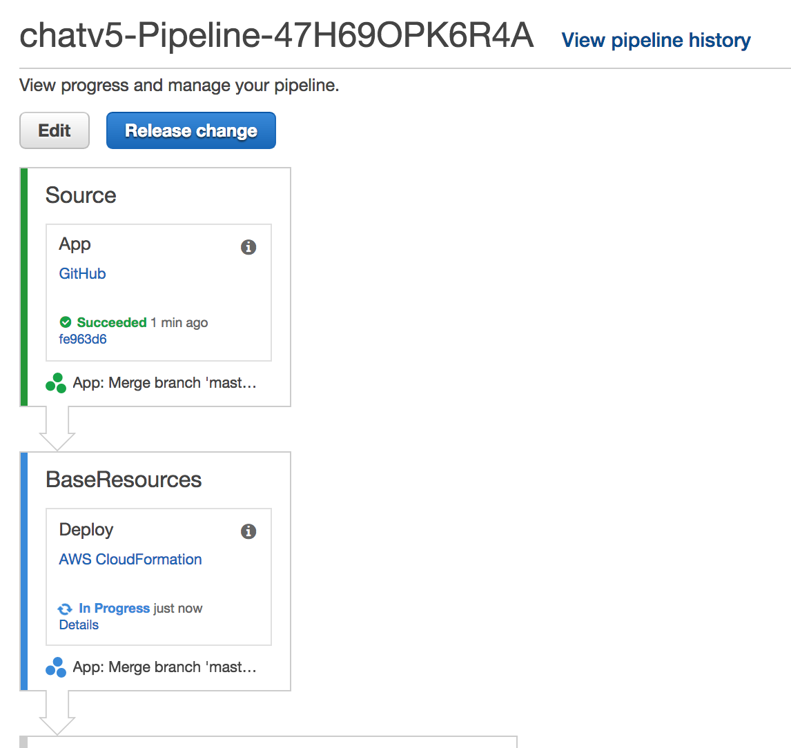

As you can see there are a few stages to the build:

- `Source` (Access the Github repo and pull the latest code)
- `BaseResources` (This CloudFormation template deploys the basic VPC, networking, and application load balancer for the application stack)
- `ChatResources` (This CloudFormation template deploys an ElastiCache Redis, DynamoDB tables and any other resources the chat service needs)
- `Build` (This is an AWS CodeBuild which builds the docker image and uploads it to AWS Elastic Container Registry)
- `Deploy` (This is a CloudFormation template creates an ECS service and task definition and gets the application container running AWS Fargate)

Once the stages are all done you will see a list of CloudFormation templates that have been deployed:

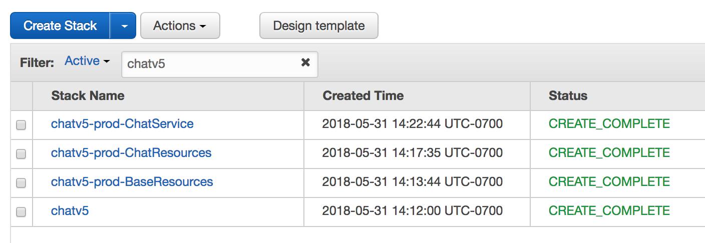

## 5. Create a Route 53 alias for the load balancer.

View the details of the `BaseResources` template. Click the "Outputs" tab and find the output `ExternalUrl`. This is the public facing URL of the load balancer that is in front of the application. However if you just try to access this URL directly you will get an ugly SSL error:

The reason for this is that the load balancer is configured to use an SSL certificate for `*.fargate.chat`. So we need to create a Route 53 alias that points at the load balancer.

Open up [Route 53](https://console.aws.amazon.com/route53/home) again click "Hosted Zones" on the left hand side. Locate the hosted zone for the domain name you created in step #1 and click into it. Then click "Create Record Set". We need to create an A record which points at the load balancer:

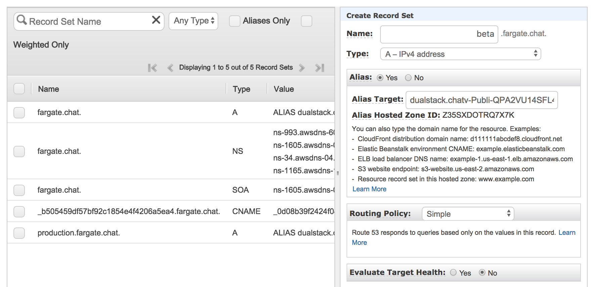

Here I am creating an alias `beta.fargate.chat` of the Alias type and I am configuring the Alias to point at the DNS name of the load balancer for my application stack. I click "Create" and now need to wait a few minutes for DNS to propagate. Route 53 propagates the new record to its DNS servers worldwide within 60 seconds, but sometimes it may take a little while longer for your ISP or other parties to pick up the changes.

## 6. Load up the application

After you wait a while for DNS to propagate you can then type in the DNS name that you just created in your browser and see your running copy of the chat app!

## 7. Make a change!

Feel free to modify your local copy of the application in your repository. Do a `git commit` and `git push` to push your changes up to Github. CodePipeline will pick up the changes and rereun the pipeline to rebuild the application and roll out your updates with zero downtime.

Enjoy the CI/CD process!

